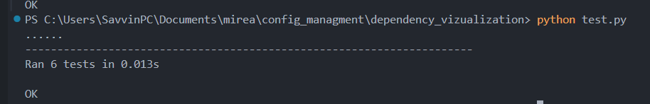
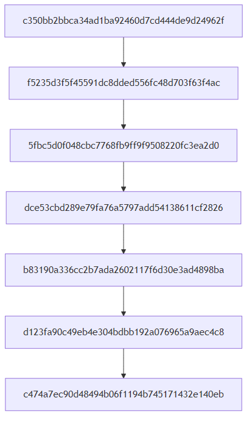

# Git Dependency Graph Visualizer

Инструмент командной строки для визуализации графа зависимостей коммитов в Git-репозитории с использованием Mermaid.

## Требования

- Python 3.6+
- Установленный Git
- Внешний инструмент для визуализации Mermaid, например [mermaid-cli](https://github.com/mermaid-js/mermaid-cli)

## Установка

1. **Склонируйте репозиторий:**

    ```bash
    git clone https://github.com/ProstoBorov01/vizualize_commit_tree.git
    cd vizualize_commit_tree.git
    ```

## Использование

```bash
python visualizer.py --visualizer /path/to/mmdc --repo /path/to/repo --output graph.png --branch main

```

## Результаты Тестов



## Результат выполнения программы

